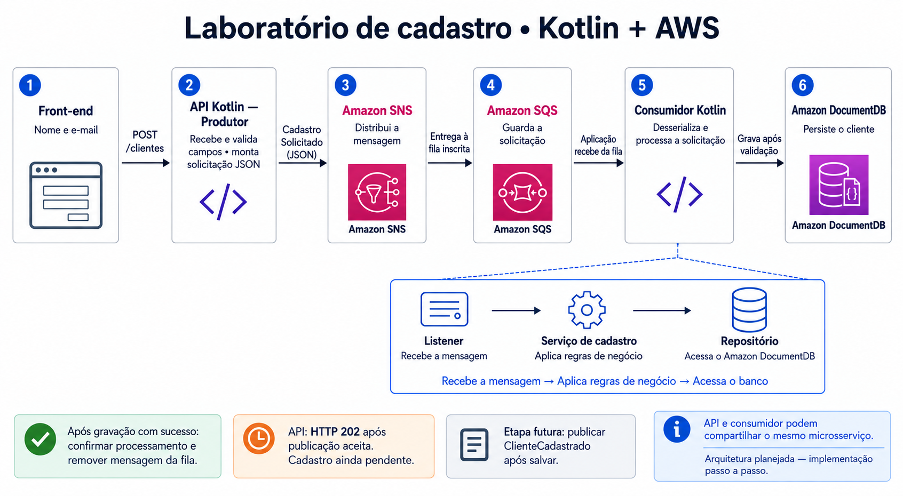

# Laboratório de cadastro assíncrono de clientes

Projeto público educacional para aprender Kotlin e as responsabilidades de cada
camada, construindo uma etapa por vez. O repositório contém somente documentação
e pastas reservadas; ainda não há aplicação executável ou infraestrutura provisionada.

## Fluxo decidido

Tela com nome e e-mail → `POST /clientes` → API Kotlin com Spring Boot →
`CadastroSolicitado` em JSON → SNS → SQS → consumidor Kotlin → serviço →
repositório → Amazon DocumentDB.

A API valida o básico e responde `202 Accepted` somente após a publicação ser
aceita pelo SNS. O cadastro permanece pendente: a API não grava o cliente antes
da fila. O consumidor desserializa a solicitação, chama o serviço para validar
regras de negócio e usa o repositório para salvar no DocumentDB.

## Organização inicial

- `frontend/`: tela, componentes, comunicação HTTP e tipos. Tecnologia ainda indefinida.
- `backend/`: pastas Kotlin para entrada HTTP, contratos, mensageria, serviços,
  persistência, configuração, erros e testes. API e consumidor podem compartilhar
  o mesmo microsserviço; a implantação será definida depois.
- `infra/`: espaço reservado para a futura infraestrutura.
- `devtools/`: espaço reservado para ferramentas do ambiente local.
- [Contexto e responsabilidades](docs/contexto.md): decisões, limites e próximos passos.
- [Documentação visual](docs/README.md) e [fonte Mermaid](docs/fluxo.mmd).

Cada pasta reservada tem um README explicativo e `.gitkeep`. Não há dependências
instaladas, versões escolhidas ou comandos de execução definidos. Nunca versionar
chaves, tokens, senhas ou outros segredos.

## Como continuar

Começar pela estrutura e pelos conceitos Kotlin, explicando cada arquivo antes de
avançar. Implementar primeiro uma pequena etapa verificável, depois integrar as
seguintes. Retentativas, DLQ, idempotência e consistência entre persistência e
publicação serão estudadas na evolução do laboratório.
