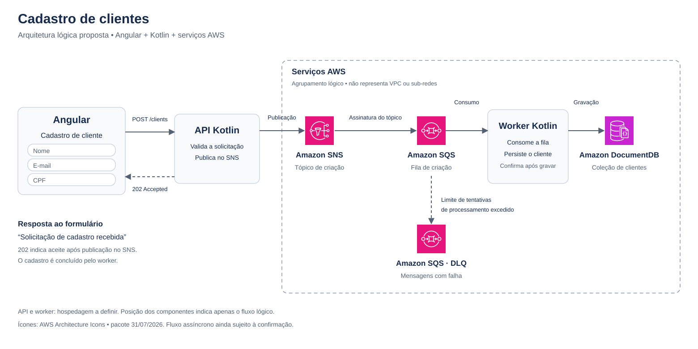

# Documentação atual

- [Contexto e decisões](contexto.md)
- [Arquitetura atual em imagem](images/arquitetura-cadastro.png)
- [Fluxo Mermaid](fluxo.mmd)

## Material histórico preservado

O conteúdo abaixo e os desenhos SVG/draw.io são referências anteriores. Menções
 a Angular, CPF, `/clients` ou fluxo ainda não confirmado estão superadas pelo
[contexto atual](contexto.md). O gerador recria apenas os desenhos históricos.

---

# Arquitetura

- [Diagrama SVG](arquitetura.svg): imagem vetorial com ícones incorporados, sem dependências externas.
- [Diagrama editável](arquitetura.drawio): abrir no diagrams.net / draw.io; textos, conectores e ícones são elementos separados.
- [Gerador](generate_architecture.py): executar `python3 docs/generate_architecture.py` na raiz para recriar os dois arquivos usando os ícones locais.

Alterações manuais no draw.io não são importadas pelo gerador. Para preservar uma
edição manual, não execute novamente o gerador sobre o arquivo alterado.

## Escopo

O Angular envia nome, e-mail e CPF por `POST /clients`. A API Kotlin publica a
solicitação no SNS e retorna `202 Accepted` após o aceite da publicação.
Uma assinatura encaminha a mensagem para SQS. O worker Kotlin consome a fila,
grava no DocumentDB e confirma a mensagem após concluir o processamento.
A DLQ recebe mensagens que excedem o limite de tentativas de processamento.

As setas representam o fluxo dos dados; o worker inicia as chamadas de consumo
da fila. O agrupamento AWS não representa uma VPC. A hospedagem do Angular, da
API e do worker ainda será definida. O fluxo assíncrono é uma proposta
reconstruída e ainda depende de confirmação, conforme o [contexto do projeto](../README.md).

## Origem dos ícones

Ícones oficiais de SNS, SQS e DocumentDB obtidos do
[AWS Architecture Icons](https://aws.amazon.com/architecture/icons/), pacote
`Icon-package_07312026`, e mantidos em `assets/aws/`.
A AWS permite o uso desses recursos para criar diagramas de arquitetura,
conforme a página de origem. Os ícones permanecem com suas cores e proporções
originais. API e worker usam caixas neutras porque seu serviço de hospedagem
ainda não foi escolhido.
