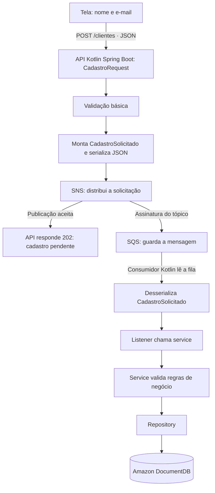

# Contexto do laboratório

## Objetivo e estado atual

O usuário já conhece APIs e programação e quer aprender Kotlin gradualmente,
com explicações das responsabilidades pasta a pasta. O domínio é cadastro de
clientes. Este scaffold contém somente documentação e diretórios reservados,
sem código da aplicação, instalação de dependências ou provisionamento AWS.

## Decisões do fluxo

1. A tela coleta nome e e-mail e envia JSON para `POST /clientes`.
2. A API Kotlin com Spring Boot recebe `CadastroRequest` e faz validação básica.
3. A API monta `CadastroSolicitado`, serializa em JSON e publica no SNS.
4. Após a publicação aceita, retorna `202 Accepted`: solicitação pendente,
   não cadastro concluído. Se a publicação falhar, não deve informar aceite.
5. O SNS distribui a solicitação para uma fila SQS inscrita no tópico.
6. O SQS guarda a mensagem. O código consumidor Kotlin lê a fila e desserializa.
7. O listener chama o service, que valida regras de negócio.
8. O service usa o repository para gravar o cliente no Amazon DocumentDB.

A API não persiste o cliente antes da fila. SNS distribui, SQS guarda e o código
consome. A confirmação de processamento da mensagem deve ocorrer depois do
sucesso; detalhes de falhas e novas tentativas serão definidos nas próximas etapas.



Fonte também disponível em [fluxo.mmd](fluxo.mmd).

## Contratos e significado dos eventos

Exemplo didático do corpo HTTP; regras detalhadas ainda serão definidas:

```json
{
  "nome": "Cliente Exemplo",
  "email": "cliente@example.com"
}
```

`CadastroRequest` representa a entrada HTTP. `CadastroSolicitado` representa uma
solicitação de trabalho, não prova que o cliente foi salvo. Um possível
`ClienteCadastrado` seria um fato emitido após a gravação, como evolução opcional.
O formato completo das mensagens e do corpo da resposta 202 ainda será decidido.

## Responsabilidades das pastas

| Pasta | Responsabilidade prevista |
| --- | --- |
| `frontend/src/components` | Componentes reutilizáveis da interface. |
| `frontend/src/pages` | Tela de cadastro com nome e e-mail. |
| `frontend/src/services` | Comunicação HTTP com POST /clientes. |
| `frontend/src/types` | Tipos usados pela interface e pelo contrato HTTP. |
| `frontend/public` | Arquivos públicos estáticos. |
| `backend/src/main/kotlin/com/example/cadastro/controllers` | Entrada HTTP: recebe CadastroRequest e coordena a solicitação. |
| `backend/src/main/kotlin/com/example/cadastro/dtos` | Contrato HTTP, incluindo CadastroRequest; separado do modelo persistido. |
| `backend/src/main/kotlin/com/example/cadastro/events` | Contrato CadastroSolicitado; ClienteCadastrado é uma evolução opcional. |
| `backend/src/main/kotlin/com/example/cadastro/messaging/producers` | Serialização e publicação da solicitação no SNS. |
| `backend/src/main/kotlin/com/example/cadastro/messaging/consumers` | Consumo do SQS, desserialização e listener que chama o serviço. |
| `backend/src/main/kotlin/com/example/cadastro/services` | Validação de negócio e coordenação da persistência. |
| `backend/src/main/kotlin/com/example/cadastro/repositories` | Acesso ao Amazon DocumentDB. |
| `backend/src/main/kotlin/com/example/cadastro/configuration` | Configuração da aplicação e integrações, sem credenciais versionadas. |
| `backend/src/main/kotlin/com/example/cadastro/errors` | Representação e tratamento de erros. |
| `backend/src/main/resources` | Recursos e configurações sem segredos. |
| `backend/src/test/kotlin` | Testes Kotlin a construir junto de cada etapa. |
| `backend/src/test/resources` | Dados e configurações de teste sem segredos. |
| `infra` | Documentação e futura infraestrutura; nenhum recurso provisionado. |
| `devtools` | Futuras ferramentas locais; ambiente ainda não definido. |

O pacote `com.example.cadastro` é inicial e pode ser ajustado. API e consumidor
podem coexistir no mesmo microsserviço; pastas distintas não exigem implantações separadas.

## Ainda não decidido

- Tecnologia do frontend, hospedagem e topologia de implantação.
- Versões de Kotlin, Spring Boot, JDK e ferramentas de build.
- Autenticação, autorização e infraestrutura local.
- Regras detalhadas de negócio, duplicidades e acompanhamento do cadastro.
- Contratos completos de eventos e resposta HTTP.

## Evolução gradual

1. Entender as pastas e os conceitos Kotlin usados em cada etapa.
2. Construir a entrada HTTP e a tela em incrementos pequenos.
3. Integrar a publicação SNS e a entrega ao SQS.
4. Construir consumo, desserialização, serviço e persistência.
5. Estudar falhas, retry, DLQ e idempotência para mensagens repetidas.
6. Avaliar consistência entre gravação e eventual publicação de ClienteCadastrado.

Essas etapas são orientação de estudo, não funcionalidades já implementadas.
Nunca versionar chaves, tokens, senhas ou certificados com chave privada.

## Referências anteriores

Fotos de pastas antigas eram referências de organização: `cloud/events`,
`clients/rest/dto`, `configuration/web`, `domains/dtos/enums`, `errors`,
`services`, `utils`, `resources/avro`, `infra`, `devtools/documentdb`, `certs`,
`tests` e `src/test`. Não comprovam implementação nem determinam o scaffold.
Não replicar os domínios de campanhas ou funcionários. Avro não foi escolhido:
a solicitação deste laboratório usa JSON.

O exemplo anterior `ExemploApi` era apenas um controller retornando uma mensagem
JSON, sem SNS ou banco. Referências antigas a Angular, CPF e `POST /clients`
não fazem parte das decisões atuais: a tela prevista tem nome/e-mail,
`POST /clientes`, e tecnologia frontend em aberto.

Os desenhos antigos foram preservados como histórico e podem conter essas
suposições superadas. Consulte este documento e o Mermaid para as decisões atuais.
